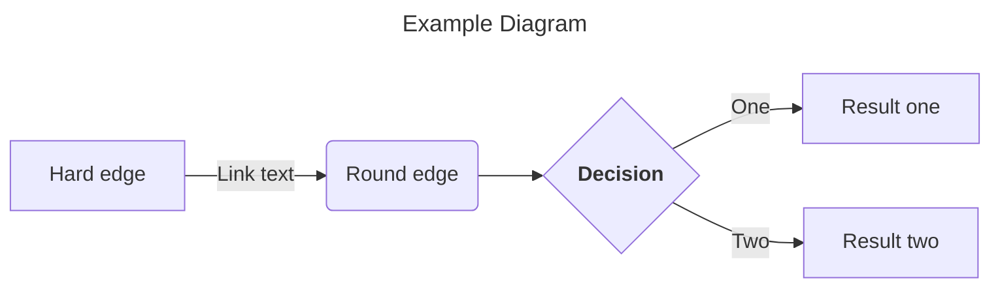

+++
title = "Getting Started"
date = 2019-09-25T01:53:09+03:30
weight = 5
chapter = true
pre = "<b>1. </b>"
+++
### Chapter 1
# Getting Started
Build a documentation website for your service using Hugo and hugo-theme-learn in less than an hour.

